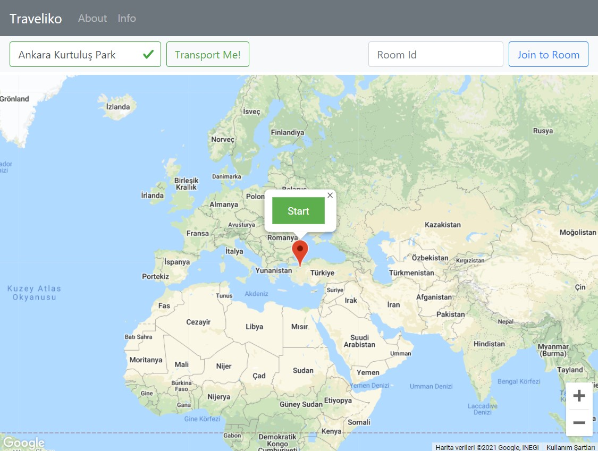

# Traveliko - Travel with Friends! 


> You can create a room with your friends and travel in street view mode and navigate the map.



The application basically allows you to travel through a specific address or by opening the street view from where the user left the pin on the map. When the user switches to the street view, a room is set up and with the room number created, different users act in the same location instantly. Thus, more than one user can stroll on the same street.

## Installation & Development Setup

1. Clone Repository

    ```sh
    git clone https://github.com/onlyilkr/traveliko.git
    ```

2.  Install packages

    ```sh
    npm install
    ```

3.  Go to Firebase Console and set up `.env file` with your Firebase Realtime Database info

    * [Go to Firebase Console](https://console.firebase.google.com/u/0)
    * [Firebase Installation](https://firebase.google.com/docs/database/web/start)

    ```
    VUE_APP_FIREBASE_API_KEY=[YOUR_FIREBASE_API_KEY]
    VUE_APP_FIREBASE_AUTH_DOMAIN=[YOUR_FIREBASE_AUTH_DOMAIN]
    VUE_APP_FIREBASE_PROJECT_ID=[YOUR_FIREBASE_PROJECT_ID]
    VUE_APP_FIREBASE_STORAGE_BUCKET=[YOUR_FIREBASE_STORAGE_BUCKET]
    VUE_APP_FIREBASE_MESSAGING_SENDER_ID=[YOUR_FIREBASE_MESSAGING_SENDER_ID]
    VUE_APP_FIREBASE_APP_ID=[YOUR_FIREBASE_APP_ID]
    VUE_APP_FIREBASE_DATABASE_URL=[YOUR_FIREBASE_DATABASE_URL]
    VUE_APP_FIREBASE_MEASUREMENT_ID=[YOUR_FIREBASE_MEASUREMENT_ID]
    ```

4.  Go to Google Cloud Platform and set up `.env file` with your Google Maps API Key info

    * [Go to Google Cloud Platform](https://console.cloud.google.com/)

    ```
    VUE_APP_GOOGLE_MAPS_API_KEY=[YOUR_GOOGLE_MAPS_API_KEY]
    ```

5. Run App

    ```sh
    npm run serve
    ```


## Release History


* 0.1.0
    * Repository shared public on Github

## Meta
### İlker Güldalı

[](https://github.com/onlyilkr)
[](https://twitter.com/onlyilkr)
[](http://ilkerguldali.com)

Distributed under the Apache license. See ``LICENSE`` for more information.

## Contributing

1. Fork it (<https://github.com/onlyilkr/traveliko.git>)
2. Create your feature branch (`git checkout -b feature/fooBar`)
3. Commit your changes (`git commit -am 'Add some fooBar'`)
4. Push to the branch (`git push origin feature/fooBar`)
5. Create a new Pull Request

